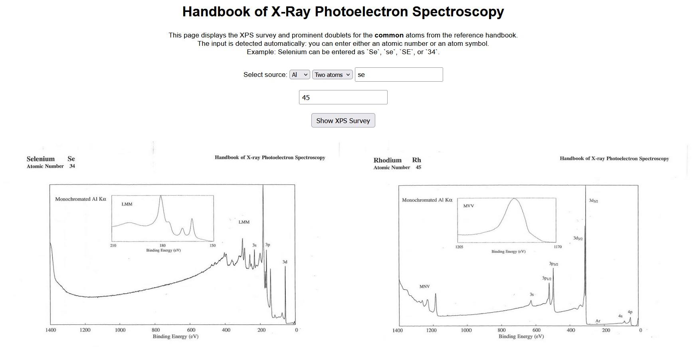

# Database of XPS corelevels (under prep)

## Description
This Project offers quick access to the XPS core levels of any atoms via an interactive web-based page. The used database is derived from the <a href="https://www.amazon.com/Handbook-Ray-Photoelectron-Spectroscopy-624755/dp/0962702625" target="_blank">Handbook of X-Ray Photoelectron Spectroscopy</a>  

## Usage
You just have to follow the link: https://aymen-mahmoudi.github.io/Corelevels/
 
Add the atomic number or the atom symbol, choose the source, and press the button to show the corresponding reference XPS curve.

## Roadmap
 <ul>
  <li>Extract and re-plot the curves from the database of images</li>
  <li>Automatic identification of the atomic composition from a given curve</li>
</ul> 

## Support and Contributing
Let me know if you have any suggestions/ideas to enhance those scripts or add further settings. Your suggestions are warmly welcomed.
  
In case of a problem, it is strongly recommended that an issue be posted. For a more confidential demand, don't hesitate to email me.

## Acknowledgment
I thank Geoffroy Kremer for providing me with a copy of the Handbook.  

